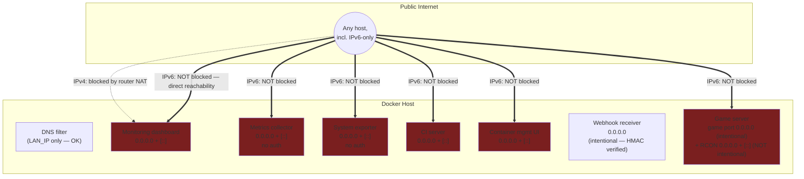

# Network Segmentation: Before / After

Placeholders: `<LAN_IP>` = the host's LAN-facing IPv4 address.
`<host-public-ipv6>` represents any globally-routable IPv6 address a
residential ISP might assign directly to the router/host.

## Before

## After

```mermaid
flowchart TB
    subgraph internet["Public Internet"]
        client(("Any host"))
        webhook_sender["Third-party webhook sender\n(legitimate caller)"]
    end

    subgraph lan["LAN only (<LAN_IP>)"]
        lanclient(("LAN device"))
    end

    subgraph host["Docker Host"]
        dns["DNS filter"]
        dash["Monitoring dashboard"]
        webhook["Webhook receiver\n(HMAC-verified per request)"]
        game["Game server\ngame port only"]

        subgraph loopback["127.0.0.1 only"]
            metrics["Metrics collector"]
            exporter["System exporter"]
            cadvisor["Container metrics collector"]
        end

        subgraph internal_net["Internal Docker network\n(no host port at all)"]
            rcon["RCON"]
        end
    end

    client -. "blocked" .-> dash
    client -. "blocked" .-> metrics
    client -. "blocked" .-> game
    webhook_sender ==> webhook
    webhook -- "internal network,\nby service name" --> rcon
    lanclient --> dns
    lanclient --> dash

    style metrics fill:#1f5c2e
    style exporter fill:#1f5c2e
    style cadvisor fill:#1f5c2e
    style rcon fill:#1f5c2e
    style dns fill:#1f5c2e
    style dash fill:#2a4a6b
```

## Key structural change, not just narrower rules

The RCON fix (finding F5) isn't "restrict who can reach the port" — it's
"the port never touches the host network namespace in the first place."
Two services that need to talk to each other share a private Docker
network and resolve each other by container hostname; nothing about that
communication path requires or benefits from a host-published port at
all. That's a stronger guarantee than a firewall rule, because there's no
rule to misconfigure or accidentally remove later — the exposure is
structurally impossible, not just currently denied.
